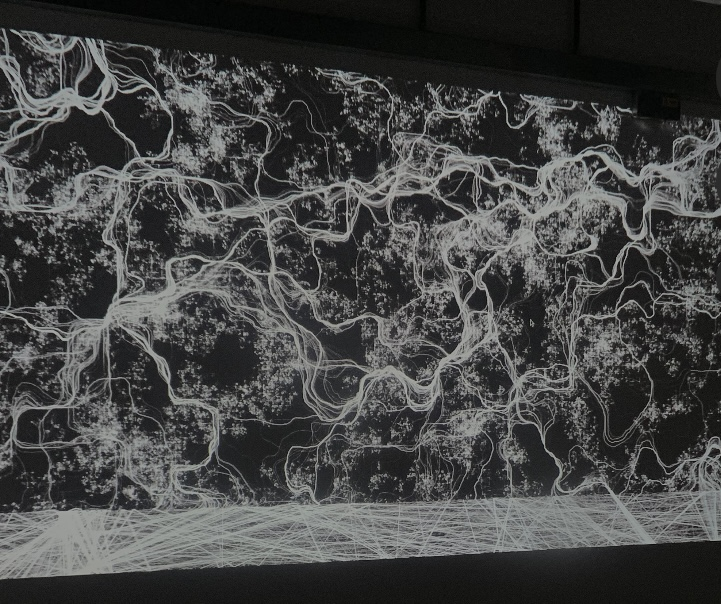

# Flow Sound

# Flow Sound
Flow Sound came from my growing interest in visual and sound, so it's an audiovisual artwork where music drives visual motion, and users can co-create sound through keyboard interaction.

# Equipment
1. A screen projector as large as possible
2. A laptop that supports sound
3. An HDMI cable
   
# How to play
1. Please first turn off the lights.
2. A mouse click to start the music.
3. ASDF are equipped with various sounds. Play with them.
4. Enjoy the audiovisual piece that you are creating right now!

